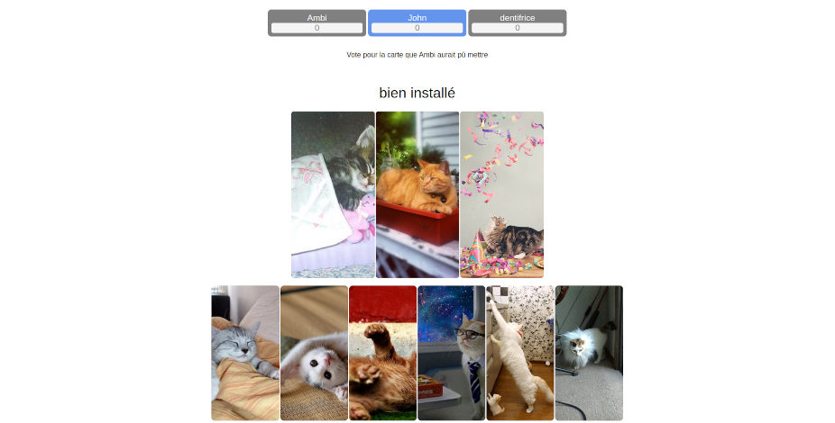

# Dixit en ligne

Dixit est un jeu de cartes en ligne, les utilisateurs peuvent créer un salon ou en rejoindre et démarrer des partie sur le thème de leur choix



Ce projet est actuellement déployé à cette URL : [ambi.dev/dixit](https://ambi.dev/dixit)


## Lancer en local

Il est possible de lancer le projet en local.

 - cloner le projet

### Soit sans Docker

> Pour cela il faut faudra PHP et MySQL (ou MariaDB).

 - créer un fichier `credentials.php` dans le dossier `src` contenant identifiants de la base de données et une clé d'API pixabay
```php
<?php
define('DB_HOST', 'localhost');
define('DB_USER', 'user');
define('DB_PASS', 'password123');
define('DB_NAME', 'dixit');
define('PIXABAY_API_KEY', '12345678-0123456789abcdef');
?>
```
 - exécuter dans la base de données le script SQL [init.sql](init.sql)
 - lancer le serveur php dans le dossier `src`


### Soit avec Docker

> Pour cela il faudra Docker et Docker Compose.

 - définir la variable d'environnement `PIXABAY_API_KEY`, cela peut se faire dans un fichier `.env` à la racine du projet
 - exécuter `docker compose up` dans le dossier racine du projet