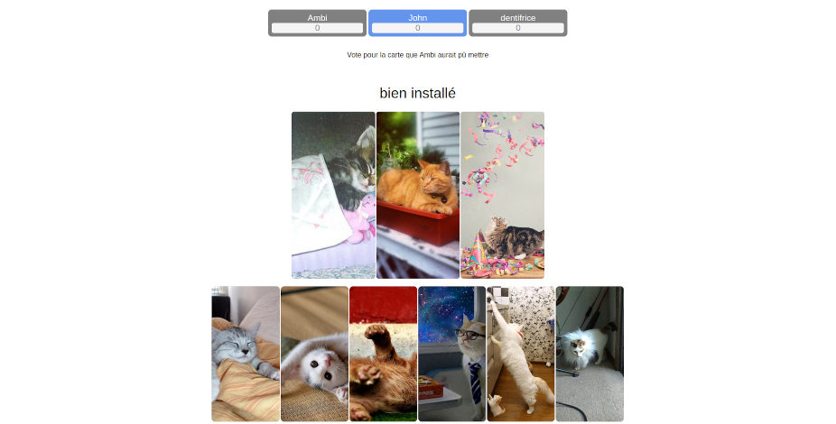

# Dixit en ligne

Dixit est un jeu de cartes en ligne, les utilisateurs peuvent créer un salon ou en rejoindre et démarrer des partie sur le thème de leur choix



Ce projet est actuellement déployé à cette URL : [ambi.dev/dixit](https://ambi.dev/dixit)

## Lancer en local

Il est possible de lancer le projet en local.
Pour cela il faut faudra un serveur avec PHP et MySQL.
 - cloner le projet
 - créer un fichier credentials.php dans le dossier api contenant identifiants de la base de données et une clé d'API pixabay
```php
<?php
define('DIXIT_DB_HOST', 'localhost');
define('DIXIT_DB_USER', 'user');
define('DIXIT_DB_PASSWORD', 'password123');
define('DIXIT_DB_NAME', 'dixit');
define('PIXABAY_API_KEY', '12345678-0123456789abcdef');
?>
```
 - exécuter dans la base de données le script SQL [init.sql](init.sql)
 - lancer le serveur php


